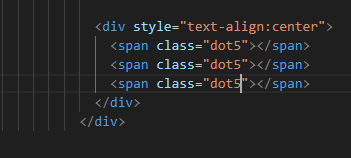
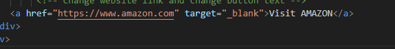
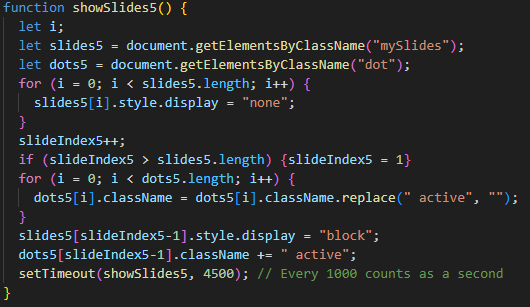

# SICTC Showcase Site (How to add more content)

## Step 1
 - Make sure to download all files in the repo
 - Open up all the files listed (index.html, style.css, script.js)
 - **I will be adding a test site to show you the most informatative way to add a new project (we will be using amazon.com for the example)**

## Step 2
 - Your VSC should look like this currently 
  
 - First, take a like at the website 1 code 
  
 - There are start & end comments for every website to help you find the locations
 - Let's take a look and understand the code within
 - Each website starts with a section tag and will end with the same section tag
 - We are going to copy the code from section tag to section tag (Like this) 
  
 - Then scroll down towards the bottom of the code till you reach the end of the last website (in my instance it's website 4)
 - You want to make sure you are pasting in the right place so make sure you past after the /section tag but above the /div tag above the footer (paste where the cursor is below) 
  
 - Now once you have the code pasted in we need to modify it 
 - We need to change things like:
 - Logo
 - Slides
 - Description
 - Anything that indicates the number of the site
 - The website link
 - The button text
 - **I will now guide you through all the steps that need to be done in the HTML**

 ## Step 3: Modification of HTML
 ### Anything that indicates the number of the site
 - First thing we need to change is the section tag and change it to website 5 
  
 - Next we need to change the mySlides class to the correct number also
 - We have to change this because later we will modify the JavaScript to run on its own class because we can't have websites running on same JS classes or else the slideshows will crash
  - Make sure to change the number on each slide (you will see in the example I modify it in three areas because there is three slides) 
  
 - We also need to change the number for the dots
 - This is necessary for the same reason as the slides  
  
 ### Description
 - Navigate to the description class right below where you modified the dots
 - Delete the content in between the p tags and replace with a proper description of the website you're adding 
  
 - What new replaced description should look like 
  
### Website Link & Button
- Right below the description you will see the website link and slightly to the right of the link will be the button text
- Simpily change these with the correct information 
 
### Making the Slides
- First things first we need to make a folder to store our slides
- Navigate to the Images folder within the Showcase file
- Then make a new folder called (xxxxxSlides) 
 
- There are other ways to source slides for the showcase, but the way I do it is to go to the website and snip 3 different pages of the website
- Make sure you only include content in the snip DO NOT include the url bar, scroll bar, or the taskbar
- Here is a short video that shows you what I mean 
 
- I recommend saving the slides named (slide1.png/slide2.png) so it is simple and easy to navigate 
- We also don't have to worry about naming them the same as another file because they are in their own personal folder
- Once you have all your snips for your slides we need to implement them into the code
- Navigate back to where the slides are in the code and change the image path to where we just made our new folder and put our snips
- Make sure to put the slide numbers in order 
 

 ### Logo
 - Now we need to change the logo and title
 - Navigate to this location close to the top of the section 
  
 - To make a logo to match the others we need to make a 500x500px logo
 - I recommend using pixlr.com
 - Once you get there click on Pixlr E editor
 - Then click create new
 - On the right-hand side of the popup change the width to 500 and the height to 500 then click create
 - Since I'm using amazon for this example I'm going to use an Amazon logo from the web 
  
 - This is what mine looked like before I saved it
 - We are going to want to save this file in the Images folder in the Showcase file (you should see the other website logos there) 
  
 - Change the image path to the new logo
 - Now we just need to change the title which is right below the image path 
  
 - Once we have completed this we are done with the HTML of adding a website

 ## Step 4: Modification of JavaScript
 - Modifying the JavaScript isn't too hard it just requires a little bit of copying and pasting and changine some numbers here and there
 - First start by navigating to script.js
 - Once your there first thing we are going to do is add another let SlideIndex 
  
 - The highlighted code is what I added (there needs to be a new slideIndex for every website on the showcase)
 - Next we need to add another showSlides function 
 
 Like this
 
 - Now we need to copy one of the function showSlides() 
  
 - Once we have this copied ... scroll to the bottom and paste
 - Now it's time to modify the code
 - We need to change:
 - showSlides#
 - slides#
 - dots#
 - slideIndex#
 - mySlides#
 ### We'll start with showSlides#
 - First change is in the first line 
  

 - Second change is in the last line 
  

 ### slides#
 - There's a few more of these to change so let's get started
 - Anywhere you see the word "slides" in the function add the number of your website to the end
 - This is what your function should look like currently 
  

 ### dots#
 - We now do the same thing for everytime we see the word "dots"
 - Here is what your function should look like after this step 
 
- DISCLAIMER!: I forgot to change the dot text in the third line of code in the function at the end where "dot" is in parenthesis it should be "dot5"

### slideIndex#
- And finally we do the same for everytime you see "slideIndex"
- Updated function below 
 

### !!DOUBLE CHECK MAKE SURE YOU MODIFIED EACH WORD DISCUSSED ELSE YOUR CODE WILL BREAK!! 

### mySlides#
- Our last step in the script.js file is changing the mySlides class number
- This is what allows it to communicate with out HTML & CSS so this step is VERY IMPORTANT! yet very simple
- It should be at the end of the second line of code inside the function 
 

## Step 5: Modification of CSS
- Navigate to style.css
- We only need to alter 4 lines of code in the file (2 of them are the same altercation)
- You can either Ctrl-F and search "mySlides" or navigate to line 167 (if you changed any css code this line number may be inaccurate)
- Once you find the line with the other mySlides class functions we are going to add our new one
- Example below 
 
- Make sure you add the . before the class
- Also don't forgot the comma that splits the classes

- Now since we have both a desktop layout and mobile layout we have to do this exact same altercation lower in the CSS code
- So you can either navigate by using Ctrl-F again or go to line 339 (once again if you've changed any code the line number may be different)
- Do the same procedure we just performed before 
- And bam should look like this 
 
- Now since we are already towards the bottom of the code we are going to go ahead and add our dots class
- If you scroll down around 20 lines you should be able to find the style function
- If you're not able to find it try doing Ctrl-F ".dot" or look at line 370
- Simply add our new dot class to the end (remember not to forget the . or ,)
- Should look like this 
 
- Now we are on our last step 
- We need to navigate to the other part where the dot classes are
- Use or previous methods to locate it or look at line 199 
 
- We are now done with the CSS

## Step 6: Check it out!
- Go to the showcase folder and open the index.html file in a browser 
 
- BOOM! We have officially added a website to the showcase
- Make sure everything looks correct and the slides are cycling
- If everything looks good you have successfully learned and added a new website to the showcase!

  